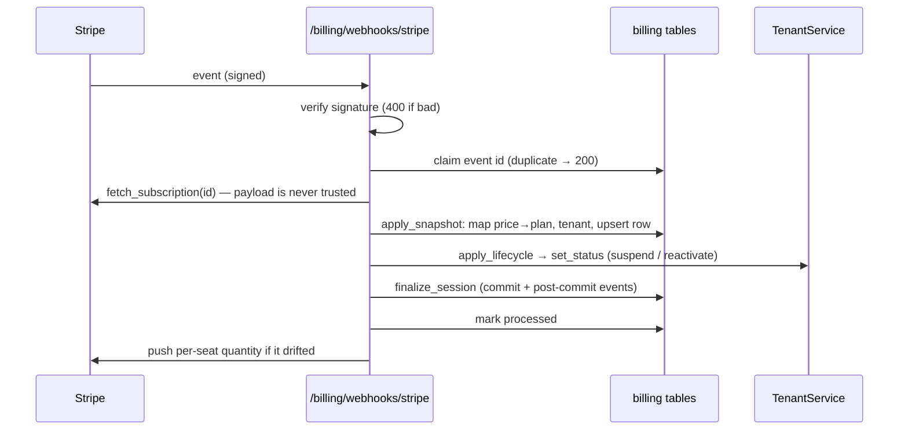

# Billing architecture

Design record: `docs/superpowers/specs/2026-10-01-billing-module-design.md`
(repo root). This page describes the code as it is.

## Boundaries

Billing sits on top of `simple_module_tenants` and uses only the seams that
module publishes; it adds nothing to `tenants_tenant` and nothing in `tenants`
imports billing.

| Seam (from `tenants`) | Billing uses it to |
|---|---|
| `app.state.tenants.entitlements` (`EntitlementProvider`) | answer `limit` / `has_feature` from the plan in force (`entitlements.PlanEntitlements`, installed in `startup.run`) |
| `TenantService.set_status` | suspend on `unpaid`, reactivate on recovery (`lifecycle.apply_lifecycle`) |
| `MembershipAdded` / `MembershipRemoved` | push the member count to Stripe for per-seat plans (`seats.subscribe`) |
| `require_active_tenant`, `tenant:<role>` roles | scope every tenant route to the session's organisation |

Stripe is behind `contracts/provider.py` (`BillingProvider`), which speaks
plain dataclasses. No Stripe object crosses it.

## Data

| Table | Key | Holds |
|---|---|---|
| `billing_plan` | `id`, unique `key`, unique price IDs | price IDs, display amounts, `limits` (JSON `{key: int}`), `features` (JSON list), default/public/archived |
| `billing_customer` | `tenant_id` | Stripe customer id, the one open Checkout session id |
| `billing_subscription` | unique `tenant_id`, unique `provider_subscription_id` | the local mirror: plan, status, interval, quantity, trial/period end, `cancel_at_period_end`, `suspended_by_billing`, `synced_at` |
| `billing_webhook_event` | provider event id | `processed_at`, `error` — idempotency and an audit trail |

One subscription row per organisation. `tenant_id` is a plain column, not a
foreign key: each module owns its own SQLAlchemy `MetaData`, so a cross-module
FK cannot resolve (`tenants` stores `user_id` the same way). None of the tables
use `MultiTenantMixin`: webhooks, reconcile and the admin list span
organisations by nature, so every query filters on `tenant_id` explicitly.

## Which plan is in force (`resolve.effective_plan`)

```
subscription.status in {trialing, active, past_due}  →  subscription's plan
anything else (no row, canceled, incomplete, unpaid) →  the default plan
```

Exactly one plan is the default, it is free, and it can be neither unset nor
archived (`plans.PlanService` enforces this), so resolution is total. Archived
plans still resolve for the organisations on them. There is no cache: a
per-process cache would be stale across workers, and the lookup is two indexed
reads.

## From Stripe to local state



Because every event re-fetches, whichever delivery lands last writes Stripe's
current view; out-of-order and duplicate deliveries are harmless. A failure
records `error`, leaves `processed_at` empty and returns 500, so Stripe's retry
reprocesses it. Two outcomes are acknowledged instead of retried forever —
`unknown_tenant` (a subscription that is not ours) and `nothing_to_apply` (a
lapse for a price we never knew, with no local row) — because a permanent 500
gets the endpoint disabled for every organisation.

`sync.apply_snapshot` is the only code that turns provider state into local
state; webhooks, reconcile, the admin **Resync** and plan changes all go
through it (`sync.resync` = fetch + apply). Its rules:

- the tenant comes from subscription metadata (`tenant_id`, set at Checkout),
  else from the Stripe customer id;
- a lapsing status with an unknown price still applies on the plan the
  organisation had, so an unmappable price never keeps paid access alive; an
  entitling status with an unknown price is an error, never the default plan;
- a canceled snapshot for an organisation's *previous* subscription is ignored
  when a different one is live.

## Lifecycle (`lifecycle.decide`)

A pure function of `(subscription status, suspended_by_billing, tenant status)`:

| Status | Tenant active | Tenant suspended by billing | Tenant suspended by an admin |
|---|---|---|---|
| `unpaid` | suspend, mark `suspended_by_billing` | no change | no change (never claimed) |
| any other | no change | reactivate, clear the mark | no change (never lifted) |

## Checkout and plan changes (`checkout.BillingService`)

Nothing here grants a plan. Checkout returns a Stripe URL; only the webhook
writes the subscription. Guards, in order: provider supports checkout; plan is
public and not archived; plan is paid and has a price for the interval; no live
subscription locally; seats fit; then, once the Stripe customer exists, no live
subscription **at Stripe** either (`live_subscription_ids`). The previous
open Checkout session is expired before a new one is created, so two tabs
cannot buy two subscriptions. The trial applies only if the organisation never
had a Stripe subscription. The Stripe customer is created with an idempotency
key derived from the tenant and its name/email, so a retry after a failed
Checkout reuses it.

## Restore mode (`context.billing_context`)

The tenants resolver never makes a suspended organisation the active tenant.
Billing's tenant routes resolve their own context: if the session's chosen
organisation is suspended **by billing** and the user is its **owner**, status
and the portal open for it (`restore=True`); checkout and plan changes stay
closed. An admin-suspended organisation is never restorable.

## Transactions — the rule that bites

Every session from `app.state.sm.db.session_factory()` is a `RequestSession`.
`TenantService.set_status` queues `TenantStatusChanged` and the membership-cache
invalidation with `db.on_commit`, and those callbacks run only through
`simple_module_db.finalize_session(session)`. **Code outside a request
(webhooks, reconcile, CLI, event handlers) must commit with
`finalize_session`, never a bare `commit()`**, or the suspension happens in the
database while every member's cached view still says active.

Plan writes flush inside a savepoint (`begin_nested`) so a concurrent create
that hits a unique constraint becomes `409 plan_key_taken` / `price_taken`
instead of a 500, and the request session stays usable.

## Settings and secrets

`BillingSettings` subclasses `DbBackedSettings` (no env sources) and is
registered with `register_module_settings`. `provider` is read once in
`on_startup` (`providers.factory.install_provider`). A `stripe` choice with a
missing or undecryptable secret falls back to `ManualProvider` and records
`provider_error` for the admin screens — the app still boots. Saving the
connection rebuilds the provider only when it is the one already chosen (new
secrets apply at once; switching provider waits for the restart the setting
promises). Secrets are `enc:v1:<fernet>` under a key derived from the app's
`secret_key` (`crypto.py`, a copy of `sm_ai.crypto`'s scheme — a published
module must not import a sibling optional module).

## Adding a payment provider

1. Implement `BillingProvider` (`contracts/provider.py`) in
   `providers/<name>.py`: map the provider's subscription to
   `SubscriptionSnapshot` (raw status string; add it to `STRIPE_STATUS_MAP` or
   a sibling map), its webhook to `WebhookEvent`, its prices to `PriceInfo`.
2. Add the name to `constants.PROVIDERS` and a branch in
   `providers/factory.build_provider`.
3. Add a webhook route next to `endpoints/webhooks.py` and register it as a
   public route in `BillingModule.register_public_routes`.
4. Test it the way `tests/test_stripe_provider.py` does: real signature
   verification on locally signed payloads, a recording stand-in for the SDK,
   no network. Everything above the protocol is already covered through
   `tests/fake_provider.py`.

## File map

| File | Responsibility |
|---|---|
| `module.py` | framework hooks only |
| `startup.py` | seed default plan, install provider and entitlements |
| `plans.py` | plan CRUD and invariants |
| `resolve.py`, `entitlements.py` | plan in force; the entitlement seam |
| `checkout.py`, `context.py`, `deps.py` | tenant-side service and request context |
| `sync.py`, `webhooks.py`, `reconcile.py`, `seats.py` | provider → local state |
| `lifecycle.py` | status → tenant suspension |
| `admin.py` | admin operations and connection settings |
| `providers/` | `manual`, `stripe`, factory |
| `endpoints/` | routers (tenant API, admin API, views, webhook) |
| `pages/`, `components/`, `hooks/`, `utils/` | React screens (only real Inertia pages under `pages/`) |
